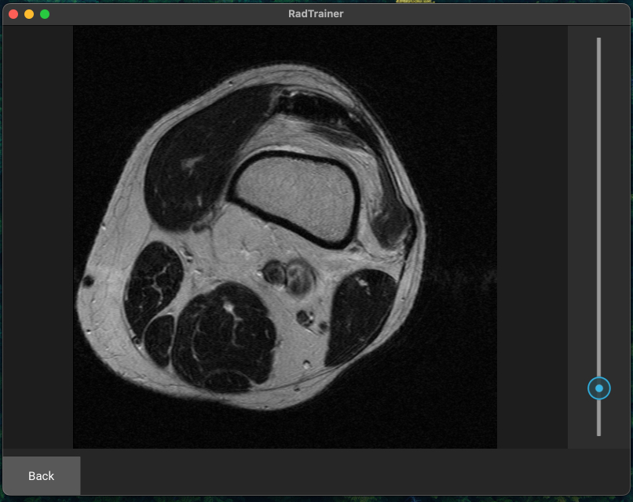

# RadTrainer

RadTrainer is a Python application built with **Kivy** to visualize DICOM medical images.  
It allows users to select a dataset of DICOM series, navigate through image slices using a slider, mouse wheel, or drag interactions, and view the images with correct anatomical orientation.




---

## Features

- Select a dataset from a folder containing multiple datasets.
- View DICOM series in correct cranio-caudal order.
- Navigate slices:
  - Mouse wheel scroll
  - Right-click drag
  - Vertical slider
- Maintains viewer state for current slice and loaded images.
- Supports multiple screens (folder/dataset selection and DICOM viewer).

---

## Project Structure

```
Project-RadTrainer/
│
├── config.py                # Configuration (dataset folder path)
├── LICENCE                  # MIT License
├── main.py                  # Application entry point
├── README.md                # Project documentation
├── requirements.txt         # dependencies
│
├── screens/                 # Kivy screens (UI)
│   ├── main_screen.py       # Folder and dataset selection logic
│   ├── main_screen.kv       # Folder/dataset selection layout
│   ├── dicom_screen.py      # DICOM viewer logic
│   ├── dicom_screen.kv      # DICOM viewer layout
│
├── dicom_viewer/            # Core DICOM processing modules
│   ├── image_processor.py   # Load DICOM and convert to PIL images
│   ├── mouse_controller.py  # Handle mouse/scroll input
│   ├── orientation.py       # Correct DICOM slice orientation
│   ├── viewer_state.py      # Manage loaded images and current slice
│   ├── texture_utils.py     # Convert PIL images to Kivy textures
│   ├── series_loader.py     # Load and sort DICOM series by anatomical position
```
---

## Dataset Folder Structure

RadTrainer expects a **2-level folder structure**:

```
DATA_FOLDER/
├── Folder_1/
│   ├── Dataset_A/
│   ├── Dataset_B/
├── Folder_2/
│   ├── Dataset_C/
│   ├── Dataset_D/
```

- **Folders** appear in the **left column** of the main screen.  
- **Datasets** inside the selected folder appear in the **center column**.  
- Only folders containing DICOM files (`.dcm`, `.dicom`) are recognized as datasets.

---
## Installation

## Installation

1. **Clone the repository:**

```bash
git clone https://github.com/gfahrni/simple-radtrainer-viewer.git
cd simple-radtrainer-viewer
```
2. **Create a Python virtual environment (recommended):**

```bash
python3 -m venv venv
source venv/bin/activate   # macOS / Linux
venv\Scripts\activate      # Windows
````

3. **Install required packages**

```bash
pip install --upgrade pip
pip install kivy pydicom numpy pillow
````

4. **Set your dataset folder in config.py:**

```bash
DATA_FOLDER = "/path/to/your/DICOM/datasets"
```

5. **Run the application**

```bash
python main.py
````

*Note: Make sure your datasets follow the 2-level folder structure described above.*


## License

This project is licensed under the MIT License.